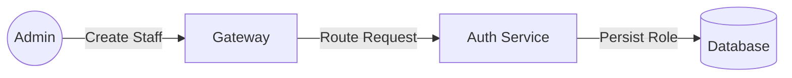
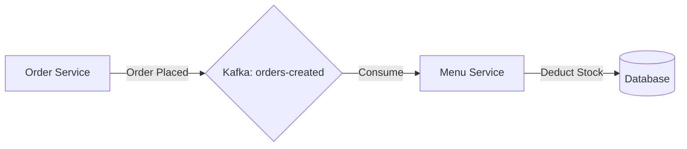
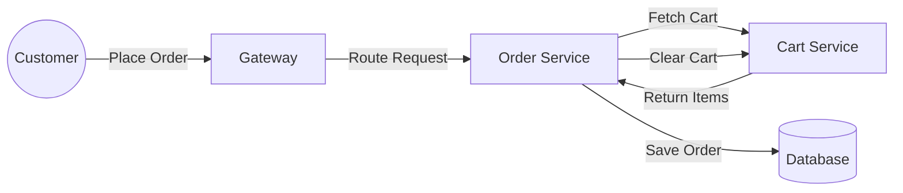
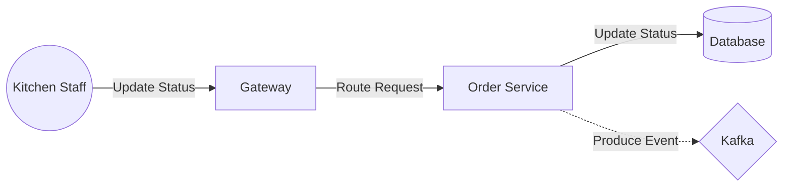
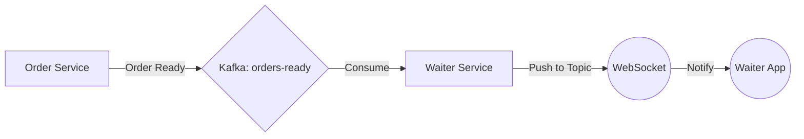

# System Analysis & User Flows

## 1. User Roles & Permissions

| Role ID | Name | Capabilities |
| :--- | :--- | :--- |
| 1 | CUSTOMER | Browse Menu, Add/Update/Remove Cart Items, Place Order, Track Order (My Orders/Table) |
| 2 | ADMIN | **Manage Staff**, **Manage Inventory**, Manage Menu (Create, Update, Delete), Manage Categories, View Analytics, View All Orders |
| 3 | KITCHEN | View Active Orders, Update Order Status, **View/Update Inventory** |
| 4 | WAITER (Proposed) | **Place Proxy Orders**, **Process Cash Payments**, Serve Orders, View Menu |

## 2. Functional Flows

Detailed step-by-step breakdown of core system flows.

### Authentication
1.  **Register (Customer)**: User submits details to `POST /api/auth/register`. System creates a new user with **Role ID 1 (CUSTOMER)**.
2.  **Login**: User submits credentials to `POST /api/auth/login`. System validates and returns a **JWT Access Token** and **Refresh Token**.
3.  **Token Usage**: Client includes `Authorization: Bearer <token>` header in subsequent protected secure requests.
4.  **Token Refresh**: When access token expires, client calls `POST /api/auth/refresh` with refresh token to get a new access token.

### Staff Management (Admin - New)
1.  **Create Staff**: Admin calls `POST /api/admin/staff` with role (Kitchen/Waiter).
2.  **Manage**: Admin updates or deletes staff access.

### Inventory Management (Kitchen/Admin - New)
1.  **View Stock**: Kitchen/Admin requests `GET /api/inventory`.
2.  **Update Stock**: Kitchen/Admin adjusts stock via `PUT /api/inventory/{itemId}` (Manual) or automatically on order confirmation.

### Ordering Process (Customer)
1.  **Menu Browse**: Customer requests `GET /api/menu` to view available items.
2.  **Add to Cart**: Customer adds items via `POST /api/cart/items`. The request is authenticated and linked to the user's ID (or Table ID).
3.  **Place Order**: Customer initiates `POST /api/orders`. The `Order Service` internally calls `Cart Service` to retrieve cart items, validates them, creates the order, and clears the cart.
4.  **Track Order**: Customer polls `GET /api/orders/table` (requiring `X-Table-Id` header) or `GET /api/orders/{orderId}` to checks status updates.

### Waiter Operations (Proxy Ordering - New)
1.  **Guest Order**: Waiter uses `POST /api/orders/proxy` to place an order for a walk-in customer (no login required).
2.  **Serve & Pay**: Waiter updates status to `SERVED` and marks payment as `CASH` via `PATCH /api/orders/{id}/pay`.

### Kitchen Operations
1.  **Fetch Active Orders**: Kitchen staff (or KDS) polls `GET /api/orders/active` to retrieve a list of orders with statuses like `PLACED` or `PREPARING`.
2.  **Update Status**: When an order is ready, staff calls `PATCH /api/orders/{id}/status` with the new status (e.g., `READY`).

### Admin Management
1.  **Manage Menu**: Admin authenticates (Role 2) and calls `POST /api/admin/menu` to create items or `PUT /api/admin/menu/{id}` to update details/availability.

### AI Assistance (Chatbot)
1.  **Ask Question**: Customer submits a natural language query about the menu to `POST /api/chat/ask` (body: `{"question": "..."}`).
2.  **RAG Process**: The AI service retrieves relevant menu items from vector storage (ChromaDB), generates a response via OpenAI, and returns it.
3.  **Sync Menu**: Internal or Admin trigger `POST /api/chat/sync-now` to update the vector database with the latest menu data from Menu Service.

### Payment Processing
1.  **Initiate Payment**: Customer (or frontend) calls `POST /api/payments/create` with amount.
2.  **PayPal Flow**: Service interacts with PayPal API and returns an approval URL.
3.  **Completion**: Frontend redirects user to the URL. (Mock mode available for dev testing).

### Real-time Notifications (Waiter/Kitchen)
1.  **Connect**: Frontend (Waiter Dashboard) connects to WebSocket at `/ws-waiter`.
2.  **Subscribe**: Client subscribes to STOMP topic `/topic/orders`.
3.  **Receive Updates**: When `Order Service` publishes a "Ready" event to Kafka, `Waiter Service` consumes it and pushes a message to subscribed WebSocket clients.

### Service Flow (Waiter)
1.  **Serve & Pay**: Waiter delivers the order and manually updates status to `SERVED`.
2.  **Cash Payment**: Waiter collects cash and closes the order transaction (`PATCH /api/orders/{id}/pay`).

## 3. Data Flow Diagrams

### Staff Management

### Inventory Updates

### Order Placement

### Kitchen Status Update

### Notification Flow (Event Driven)

## 4. API & Security Map

| Gateway Path | Method | Required Role | Backend Service | Notes |
| :--- | :--- | :--- | :--- | :--- |
| `/api/auth/register` | POST | Public | Auth Service | Creates Customer (Role 1) |
| `/api/auth/login` | POST | Public | Auth Service | Returns JWT |
| `/api/admin/staff` | POST | Admin | Auth Service | **(Proposed)** Create Staff |
| `/api/menu/**` | GET | Public | Menu Service | Includes Categories, Items |
| `/api/inventory/**` | GET/PUT | Kitchen/Admin | Menu Service | **(Proposed)** Stock Mgmt |
| `/api/cart/**` | ANY | Customer (Auth) | Cart Service | Manage Cart Items |
| `/api/orders` | POST | Customer (Auth) | Order Service | Place Order |
| `/api/orders/proxy` | POST | Waiter (Auth) | Order Service | **(Proposed)** Waiter Ordering |
| `/api/orders/table` | GET | Customer (Auth) | Order Service | Track Table Orders |
| `/api/orders/active` | GET | Kitchen / Admin | Order Service | Kitchen View |
| `/api/orders/{id}/status` | PATCH | Kitchen / Admin | Order Service | Update Status |
| `/api/orders/{id}/pay` | PATCH | Waiter (Auth) | Order Service | **(Proposed)** Cash Payment |
| `/api/admin/menu/**` | ALL | Admin | Menu Service | CRUD Menu |
| `/api/ai/ask` | POST | Public | AI Service | Chatbot Query |
| `/api/payments/create` | POST | Customer (Auth) | Payment Service | Initiate PayPal |
| `/ws-waiter` | WS | Staff | Waiter Service | Direct WebSocket (Port 8085/8088?) |

## 5. Exception Handling & Edge Cases

Common failure scenarios and system responses:

1.  **Inventory Shortage**:
    -   **Scenario**: Order placed for item with 0 stock.
    -   **Handling**: `Order Service` checks `Menu Service` (Inventory). Throws `OutOfStockException`.
    -   **Response**: `409 Conflict` - "Item X is out of stock".

2.  **Empty Cart on Order**:
    -   **Scenario**: User attempts to `POST /api/orders` with an empty cart.
    -   **Handling**: `Order Service` receives empty list from `Cart Service`. Throws `BadRequestException`.
    -   **Response**: `400 Bad Request` with message "Cart is empty".

2.  **Invalid or Expired Token**:
    - **Scenario**: User makes a request with an invalid/expired JWT.
    - **Handling**: API Gateway `JwtAuthenticationFilter` fails validation.
    - **Response**: `401 Unauthorized` or `403 Forbidden` (if role mismatch).

3.  **Item Out of Stock / Invalid Item**:
    - **Scenario**: User tries to order an item that has been disabled by Admin.
    - **Handling**: `Order Service` (or `Cart Service` during add) validates item existence/status via Menu Service.
    - **Response**: `404 Not Found` (Item not found) or `400 Bad Request` (Item unavailable).

4.  **Payment Failure**:
    - **Scenario**: PayPal transaction fails or is cancelled.
    - **Handling**: Frontend receives error from PayPal.
    - **Response**: Frontend should prompt retry.

---

**Note:**
1.  **Kitchen Functionality**: Logic resides in `order-service` endpoints (`/api/orders/active`, `/api/orders/{id}/status`) despite a separate `kds-service` route (`/api/kds/**`) existing in the Gateway configuration.
2.  **WebSockets**: `waiter-service` provides real-time updates. Frontend may need to connect directly to the service port or configure Gateway WebSocket routing explicitly.
3.  **AI Service**: The chatbot RAG pipeline runs on a separate Python service, routed via `/api/ai` by the Gateway.
